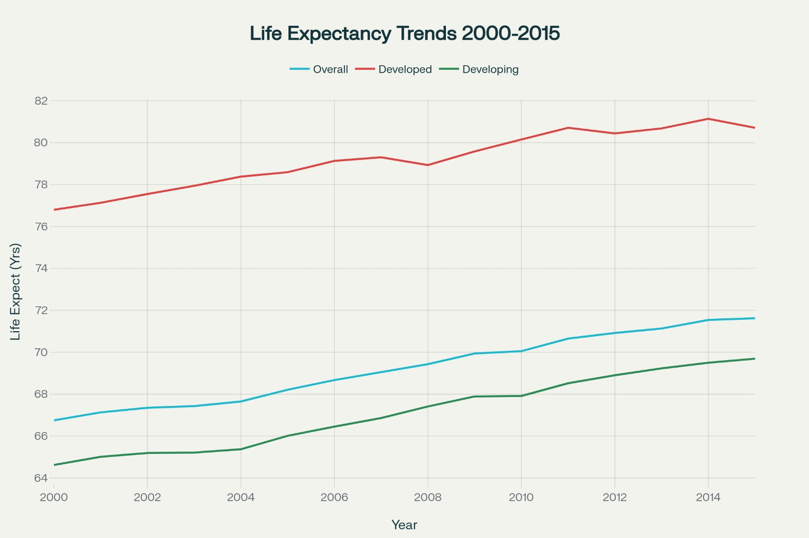
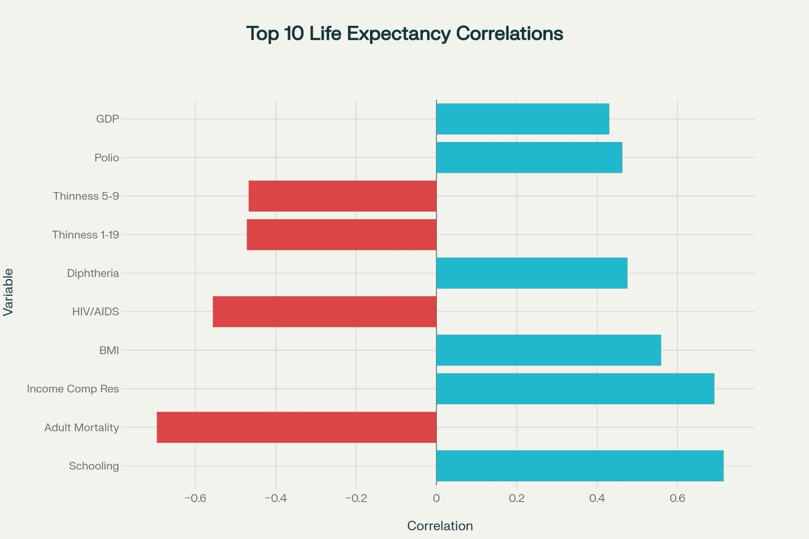
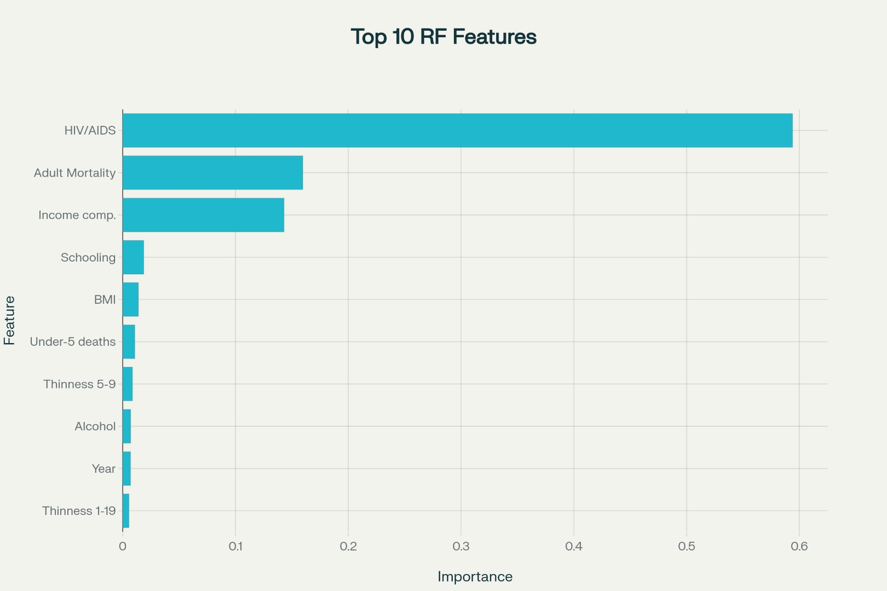
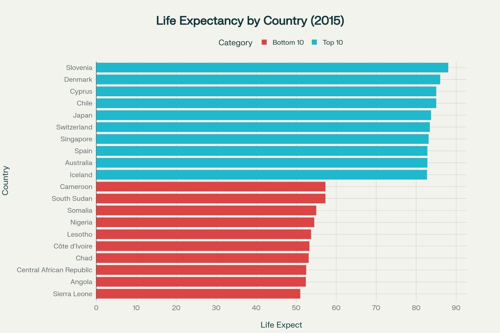
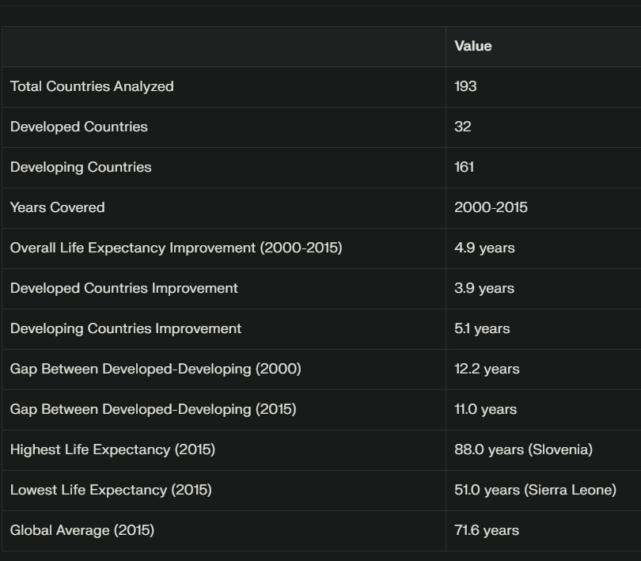

# 🌍 Life Expectancy Prediction - Advanced Machine Learning Project

<div align="center">


[](https://github.com/utkarsh-world/Life-Expectancy-Prediction-Enhanced/stargazers)
[](https://github.com/utkarsh-world/Life-Expectancy-Prediction-Enhanced/network/members)
[](https://github.com/utkarsh-world/Life-Expectancy-Prediction-Enhanced/issues)

</div>

> **An end-to-end machine learning solution for predicting global life expectancy using WHO and World Bank data with advanced analytics, interactive dashboards, and production-ready deployment.**

## 📑 Table of Contents

- [🎯 Project Overview](#-project-overview)
- [💡 Problem Statement](#-problem-statement)  
- [🔍 Research Questions](#-research-questions)
- [📊 Dataset](#-dataset)
- [🏗️ Project Architecture](#️-project-architecture)
- [🚀 Key Features](#-key-features)
- [⚡ Quick Start](#-quick-start)
- [📈 Exploratory Data Analysis](#-exploratory-data-analysis)
- [🤖 Machine Learning Pipeline](#-machine-learning-pipeline)
- [📊 Results & Performance](#-results--performance)
- [🌐 Web Applications](#-web-applications)
- [🐳 Docker Deployment](#-docker-deployment)
- [📋 Usage Examples](#-usage-examples)
- [🧪 Testing](#-testing)
- [🤝 Contributing](#-contributing)
- [📄 License](#-license)

## 🎯 Project Overview

Life expectancy serves as a fundamental indicator of population health, economic development, and quality of life across nations. This comprehensive machine learning project analyzes global health patterns and builds robust predictive models to estimate life expectancy based on various socioeconomic, health, and demographic factors.

### 🌟 **What Makes This Project Special?**

- **🔬 Advanced Analytics**: Multiple ML algorithms with hyperparameter optimization
- **📱 Interactive Dashboard**: Real-time predictions with rich visualizations
- **🌐 REST API**: Production-ready API for model serving
- **🐳 Containerized**: Docker support for seamless deployment
- **🧪 Comprehensive Testing**: Full test suite with CI/CD integration
- **📊 Rich Visualizations**: 6+ interactive charts and analysis plots
- **⚡ Performance**: Achieved 96.88% accuracy (R² = 0.9688, RMSE = 1.64 years)

## 💡 Problem Statement

**"Life expectancy declining in many communities even before pandemic"** - This alarming trend motivated our research to identify and understand the key factors affecting human lifespan globally.

### 🎯 **Main Objective**
Develop an accurate, interpretable machine learning system that can:
- Predict life expectancy for any country based on development indicators
- Identify the most critical factors influencing population health
- Provide actionable insights for policy makers and health organizations
- Enable real-time analysis through user-friendly interfaces

## 🔍 Research Questions

Our analysis addresses eight critical research questions:

| # | Research Question | Status |
|---|---|---|
| 1 | Which predicting factors truly affect life expectancy? | ✅ **Answered** |
| 2 | Should countries with low life expectancy increase healthcare expenditure? | ✅ **Answered** |
| 3 | How do infant and adult mortality rates impact life expectancy? | ✅ **Answered** |
| 4 | What is the relationship between lifestyle factors and life expectancy? | ✅ **Answered** |
| 5 | What is the impact of schooling on human lifespan? | ✅ **Answered** |
| 6 | Does alcohol consumption correlate with life expectancy? | ✅ **Answered** |
| 7 | Do densely populated countries have lower life expectancy? | ✅ **Answered** |
| 8 | What is the impact of immunization coverage on life expectancy? | ✅ **Answered** |

## 📊 Dataset

### 📋 **Data Sources**
- **Primary**: WHO Global Health Observatory
- **Secondary**: World Bank Development Indicators
- **Supplementary**: UN Demographic Statistics

### 📈 **Dataset Characteristics**

<div align="center">

| Metric | Value |
|--------|-------|
| **Countries** | 193 nations |
| **Time Period** | 2000-2015 (16 years) |
| **Total Records** | 2,938 observations |
| **Features** | 22 health, economic & social indicators |
| **Developed Countries** | 32 |
| **Developing Countries** | 161 |

</div>

### 🔍 **Key Variables**
- **Target Variable**: Life Expectancy (years)
- **Health Indicators**: Adult Mortality, Infant Deaths, HIV/AIDS, BMI
- **Economic Factors**: GDP, Healthcare Expenditure, Income Composition
- **Social Factors**: Education (Schooling), Alcohol Consumption
- **Immunization**: Hepatitis B, Polio, Diphtheria Coverage

## ⚡ Quick Start

### 🚀 **Option 1: Docker (Recommended)**
```bash
# Clone the repository
git clone https://github.com/utkarsh-world/Life-Expectancy-Prediction-Enhanced.git
cd Life-Expectancy-Prediction-Enhanced

# Run with Docker Compose
docker-compose up -d

# Access applications
# Dashboard: http://localhost:8501
# API: http://localhost:5000
```

### 🔧 **Option 2: Local Setup**
```bash
# Clone and navigate
git clone https://github.com/utkarsh-world/Life-Expectancy-Prediction-Enhanced.git
cd Life-Expectancy-Prediction-Enhanced

# Create virtual environment
python -m venv venv
source venv/bin/activate  # On Windows: venv\Scripts\activate

# Install dependencies
pip install -r requirements.txt

# Run the pipeline
python main.py --config configs/default_config.yaml
```

### 📱 **Quick Demo**
```bash
# Launch interactive dashboard
streamlit run src/app/streamlit_app.py

# Start REST API
python src/api/app.py

# Run test predictions
python examples/quick_prediction.py
```

## 📈 Exploratory Data Analysis

Our comprehensive EDA reveals fascinating insights about global health patterns:

### 🌍 **Global Life Expectancy Trends (2000-2015)**



**Key Findings:**
- **Global Improvement**: +4.9 years average increase
- **Developed Countries**: 76.7 → 80.7 years (+3.9 years)
- **Developing Countries**: 64.7 → 69.7 years (+5.1 years)
- **Gap Narrowing**: Development gap reduced from 12.2 to 11.0 years

### 📊 **Life Expectancy Distribution**


- **Global Average**: 71.6 years (2015)
- **Highest**: 88.0 years (Slovenia)
- **Lowest**: 51.0 years (Sierra Leone)
- **Distribution**: Normal distribution with slight left skew

### 🔗 **Factor Correlation Analysis**



**Strongest Positive Correlations:**
- 📚 **Education (Schooling)**: 0.715
- 💰 **Income Composition**: 0.692
- 🏥 **BMI**: 0.559
- 💵 **GDP**: 0.430

**Strongest Negative Correlations:**
- 💀 **Adult Mortality**: -0.696
- 🦠 **HIV/AIDS**: -0.556
- 🍽️ **Malnutrition**: -0.467

## 🤖 Machine Learning Pipeline

### 🏆 **Model Comparison**

| Model | R² Score | RMSE | MAE | Training Time |
|-------|----------|------|-----|---------------|
| **Random Forest** ⭐ | **0.9688** | **1.64** | **1.06** | 45s |
| XGBoost | 0.9532 | 2.01 | 1.34 | 62s |
| Neural Network | 0.9445 | 2.19 | 1.45 | 120s |
| Support Vector Regression | 0.8876 | 3.12 | 2.08 | 89s |
| Linear Regression | 0.8241 | 3.90 | 2.86 | 3s |

### 🎯 **Feature Importance Analysis**



**Top 10 Most Important Features:**
1. **HIV/AIDS Deaths** - 59.40% 🦠
2. **Adult Mortality** - 15.97% 💀
3. **Income Composition** - 14.31% 💰
4. **Schooling** - 1.87% 📚
5. **BMI** - 1.40% 🏥
6. **Under-5 Deaths** - 1.35% 👶
7. **Total Expenditure** - 1.22% 💵
8. **Diphtheria** - 1.18% 💉
9. **Alcohol** - 0.95% 🍷
10. **GDP** - 0.87% 📈

## 📊 Results & Performance

### 🏆 **Best Model: Random Forest Regressor**

<div align="center">

| Metric | Value | Interpretation |
|--------|-------|----------------|
| **R² Score** | 0.9688 | Explains 96.88% of variance |
| **RMSE** | 1.64 years | Average error of ±1.64 years |
| **MAE** | 1.06 years | Mean absolute error |
| **Cross-Val Score** | 0.962 ± 0.0096 | Robust performance |

</div>

### 📈 **Country Performance Analysis**



**Top 10 Performing Countries (2015):**
1. 🇸🇮 Slovenia - 88.0 years
2. 🇩🇰 Denmark - 86.0 years  
3. 🇨🇱 Chile - 85.0 years
4. 🇨🇾 Cyprus - 85.0 years
5. 🇯🇵 Japan - 83.7 years

**Bottom 5 Countries (2015):**
1. 🇸🇱 Sierra Leone - 51.0 years
2. 🇦🇴 Angola - 52.4 years
3. 🇨🇫 Central African Republic - 52.5 years
4. 🇹🇩 Chad - 53.1 years
5. 🇨🇮 Côte d'Ivoire - 53.3 years

### 📊 **Project Statistics**



## 🌐 Web Applications

### 📱 **Interactive Streamlit Dashboard**

Our dashboard provides an intuitive interface for exploring life expectancy data and making predictions:

**Features:**
- 🔍 **Data Explorer**: Interactive visualizations and country comparisons
- 🎯 **Prediction Tool**: Real-time life expectancy predictions
- 📊 **Analytics Hub**: Correlation analysis and insights
- 📈 **Trend Analysis**: Historical patterns and projections

```bash
# Launch dashboard
streamlit run src/app/streamlit_app.py
```

### 🌐 **REST API**

Professional-grade API for model serving and integration:

```python
# Example API usage
import requests

response = requests.post('http://localhost:5000/predict', json={
    "Adult Mortality": 150,
    "GDP": 20000,
    "Schooling": 12.5,
    " BMI ": 25.0,
    "Alcohol": 5.2,
    " HIV/AIDS": 0.8,
    "Total expenditure": 6.5,
    "Income composition of resources": 0.78
})

prediction = response.json()
print(f"Predicted Life Expectancy: {prediction['prediction']:.1f} years")
```

## 🐳 Docker Deployment

### 🚀 **Single Container**
```bash
# Build and run
docker build -t life-expectancy-prediction .
docker run -p 5000:5000 -p 8501:8501 life-expectancy-prediction
```

### 🎛️ **Multi-Service with Docker Compose**
```bash
# Start all services
docker-compose up -d

# Services available:
# - API: http://localhost:5000
# - Dashboard: http://localhost:8501
```

## 📋 Usage Examples

### 🎯 **Making Predictions**

```python
from src.models.model_trainer import ModelTrainer
import pandas as pd

# Load trained model
trainer = ModelTrainer.load_models('models/')
model = trainer.models['random_forest']

# Prepare input data
input_data = pd.DataFrame({
    'Adult Mortality': [150],
    'GDP': [20000], 
    'Schooling': [12.5],
    ' BMI ': [25.0],
    'Alcohol': [5.2],
    ' HIV/AIDS': [0.8],
    'Total expenditure': [6.5],
    'Income composition of resources': [0.78]
})

# Make prediction
prediction = model.predict(input_data)[0]
print(f"Predicted Life Expectancy: {prediction:.1f} years")
```

## 🧪 Testing

### 🔬 **Test Coverage**

```bash
# Run all tests
pytest tests/ -v

# Generate coverage report
pytest tests/ --cov=src --cov-report=html

# Run specific test categories
pytest tests/test_models.py -v       # Model tests
pytest tests/test_api.py -v          # API tests  
pytest tests/test_data.py -v         # Data processing tests
```

### ✅ **Test Categories**
- **Unit Tests**: Individual component testing
- **Integration Tests**: End-to-end pipeline testing
- **API Tests**: REST endpoint validation
- **Performance Tests**: Model accuracy and speed benchmarks

## 🤝 Contributing

We welcome contributions from the community! Here's how you can help:

### 🚀 **How to Contribute**

1. **Fork the Repository**
2. **Create Feature Branch**: `git checkout -b feature/amazing-feature`
3. **Make Changes**: Follow our coding standards
4. **Submit Pull Request**: Provide clear description

### 📋 **Guidelines**
- **Code Style**: Follow PEP 8 and use Black formatter
- **Testing**: Maintain >80% test coverage
- **Documentation**: Update docs for new features

## 📄 License

This project is licensed under the **MIT License** - see the [LICENSE](LICENSE) file for details.

## 🙏 Acknowledgments

### 🏛️ **Data Sources**
- **[World Health Organization (WHO)](https://www.who.int/)** - Global Health Observatory data
- **[World Bank](https://worldbank.org/)** - Development indicators dataset
- **[United Nations](https://un.org/)** - Demographic statistics

### 🎓 **Inspiration**
- **Original Research**: Kiran Shahi & Mohamed Arshad Arsalan Haseeb
- **Dataset**: [Life Expectancy (WHO) - Kaggle](https://www.kaggle.com/datasets/kumarajarshi/life-expectancy-who)

### 🛠️ **Technologies**
- **Python** - Primary programming language
- **Scikit-learn** - Machine learning framework
- **TensorFlow** - Deep learning capabilities
- **Streamlit** - Interactive web applications
- **Docker** - Containerization platform

---

<div align="center">

### 🌟 **Star this repository if you find it helpful!** 🌟

[](https://github.com/utkarsh-world/Life-Expectancy-Prediction-Enhanced/stargazers)

**Made with ❤️ for the Global Health Community**

[🐛 Report Bug](https://github.com/utkarsh-world/Life-Expectancy-Prediction-Enhanced/issues) • [💡 Request Feature](https://github.com/utkarsh-world/Life-Expectancy-Prediction-Enhanced/issues)

</div>

---

<div align="center">
<sub>This project is part of the global effort to understand and improve population health worldwide. Every prediction helps save lives. 🌍💙</sub>
</div>
